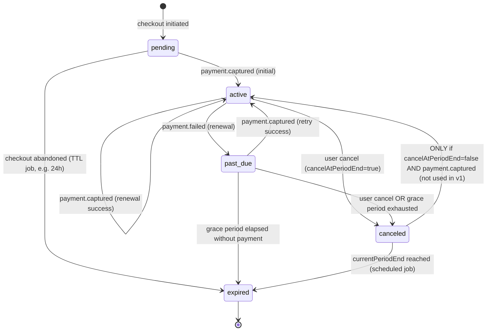
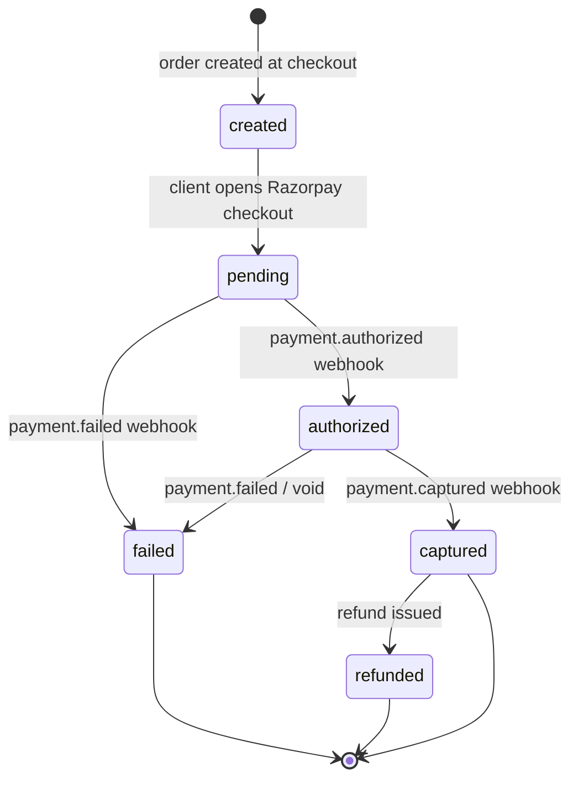

# Architecture

Production-grade subscription billing platform. This document records data models, state machines, and explicit decisions for edge cases. Implementation must follow these choices unless a later section documents a deliberate revision.

## Summary (read this first)

**Entities:** User, Plan (per-interval catalog rows), Subscription (embeds an immutable `planSnapshot`), Payment, Invoice, WebhookEvent (the idempotency gate), NotificationLog.

**State machines:** Subscription moves `pending → active → past_due/canceled → expired`. Payment moves `created → pending → authorized → captured/failed → refunded`. Only `payment.captured` grants or extends access — `authorized` is informational only, since Razorpay can void an authorization before capture.

**The six edge-case decisions this assignment is graded on, in one line each:**

1. Subscription activates on `payment.captured` — never on the client-side checkout callback, never on `authorized`.
2. Duplicate webhooks are absorbed by an atomic unique-index insert on `WebhookEvent.gatewayEventId`, backed by domain-level idempotency keys on Payment, Invoice, and NotificationLog as a second layer.
3. Upgrades charge a prorated difference immediately, in integer paise, and apply right away.
4. Downgrades are deferred to `currentPeriodEnd` with no charge — prevents a use-then-downgrade-for-refund exploit.
5. Cancel does not revoke access immediately — access continues until `currentPeriodEnd`; a scheduled sweep flips status to `expired` once that date passes.
6. A payment captured after a subscription was already canceled triggers a refund, not a re-activation — honors the user's cancel intent.

**Known limitations (deliberate, time-boxed trade-offs — not oversights):**

- Refresh tokens are stored in browser `localStorage`, not an httpOnly cookie. Simpler to implement given time constraints; more exposed to XSS than a cookie-based approach would be.
- Notifications are logged to `NotificationLog` on every relevant event but are not sent as real emails — Resend integration was deprioritized in favor of correctness on payments/webhooks/lifecycle, which are the explicitly graded flows.
- The period-end sweep (expiry, scheduled downgrades) runs on `node-cron` in-process rather than a durable job queue (e.g. BullMQ). A missed tick during a process restart would delay a transition, not corrupt data — acceptable for this scope, not for real production traffic.
- Several `@typescript-eslint` rules (`no-misused-promises`, `no-confusing-void-expression`, `no-floating-promises`) are disabled in `apps/web`. The async event handlers they flagged (onClick/useEffect callbacks) are functionally correct but not explicitly wrapped with `void`; a production pass would do so handler-by-handler.

---

## Data Model

All monetary values are stored as **integer paise** (INR minor units). No floats anywhere.

### User

Represents an authenticated account that can hold subscriptions.


| Field                | Type          | Notes                                      |
| -------------------- | ------------- | ------------------------------------------ |
| `_id`                | ObjectId      | Primary key                                |
| `email`              | string        | Unique, normalized lowercase               |
| `passwordHash`       | string        | bcrypt hash                                |
| `name`               | string        | Display name                               |
| `razorpayCustomerId` | string | null | Gateway customer id, set on first checkout |
| `createdAt`          | Date          |                                            |
| `updatedAt`          | Date          |                                            |


**Indexes:** unique on `email`.

---

### Plan

Catalog item for a single billing interval of a tier. Monthly and yearly variants of the same product tier are **separate documents** linked by `planGroup`, not a boolean flag. Adding a new interval (e.g. `QUARTERLY`) is a new document with the same `planGroup` — no schema or code change to existing plans.


| Field             | Type     | Notes                                                                   |
| ----------------- | -------- | ----------------------------------------------------------------------- |
| `_id`             | ObjectId | Primary key                                                             |
| `planGroup`       | string   | Stable slug linking tier variants, e.g. `"prime"`, `"basic"`            |
| `name`            | string   | Display name, e.g. `"Prime"`                                            |
| `description`     | string   | Marketing copy                                                          |
| `billingInterval` | enum     | `MONTHLY` | `YEARLY` (extensible enum, not boolean)                     |
| `priceInPaise`    | number   | Integer ≥ 1                                                             |
| `currency`        | string   | Fixed `"INR"` for this project                                          |
| `features`        | string[] | Feature bullets for UI                                                  |
| `isActive`        | boolean  | `false` hides plan from new checkout; existing subscriptions unaffected |
| `sortOrder`       | number   | Display ordering within a group                                         |
| `createdAt`       | Date     |                                                                         |
| `updatedAt`       | Date     |                                                                         |


**Indexes:** unique compound `(planGroup, billingInterval)` among active plans; index on `planGroup` for listing variants.

**Example:** Prime Monthly and Prime Yearly share `planGroup: "prime"` but differ in `billingInterval` and `priceInPaise`.

---

### Subscription

A user's recurring billing relationship. References **frozen plan snapshot data** captured at the time the subscription was created or last plan-changing event — not a live join to `Plan`.


| Field                    | Type          | Notes                                                                 |
| ------------------------ | ------------- | --------------------------------------------------------------------- |
| `_id`                    | ObjectId      | Primary key                                                           |
| `userId`                 | ObjectId      | Ref → User                                                            |
| `planSnapshot`           | object        | **Immutable billing terms for this subscription** (see below)         |
| `status`                 | enum          | See Subscription State Machine                                        |
| `currentPeriodStart`     | Date          | Start of paid access window                                           |
| `currentPeriodEnd`       | Date          | End of paid access window (exclusive boundary for renewal)            |
| `cancelAtPeriodEnd`      | boolean       | `true` when user canceled but retains access until `currentPeriodEnd` |
| `canceledAt`             | Date | null   | When user initiated cancel                                            |
| `scheduledPlanSnapshot`  | object | null | Populated on downgrade/interval change scheduled for period end       |
| `razorpaySubscriptionId` | string | null | Gateway subscription id if using Razorpay Subscriptions API           |
| `createdAt`              | Date          |                                                                       |
| `updatedAt`              | Date          |                                                                       |


`planSnapshot` **shape (embedded, not a ref):**


| Field             | Type     | Notes                                         |
| ----------------- | -------- | --------------------------------------------- |
| `planId`          | ObjectId | Original Plan `_id` at time of snapshot       |
| `planGroup`       | string   | Tier slug                                     |
| `name`            | string   | Plan display name at snapshot time            |
| `billingInterval` | enum     | `MONTHLY` | `YEARLY`                          |
| `priceInPaise`    | number   | Price locked for this subscription's renewals |


**Why snapshot instead of live Plan reference:** If an admin raises Prime Monthly from ₹999 to ₹1,499, existing subscribers must continue paying ₹999 until they explicitly change plans. A live `planId` reference would either silently overcharge on renewal (if code reads current Plan price) or require complex "grandfathering" flags on Plan. Embedding `planSnapshot` at subscribe/upgrade time makes the contract explicit in the subscription document: renewal charges use `subscription.planSnapshot.priceInPaise`, never `Plan.priceInPaise`. Plan catalog changes affect **new** subscriptions only.

**Indexes:** `(userId, status)`; index on `currentPeriodEnd` for expiry job; partial unique index ensuring at most one `active` | `past_due` | `canceled` (with `cancelAtPeriodEnd: true`) subscription per user per `planGroup` if business rule requires single tier (document choice at implementation).

---

### Payment

One gateway payment attempt tied to a subscription (initial purchase or renewal).


| Field               | Type            | Notes                                                                     |
| ------------------- | --------------- | ------------------------------------------------------------------------- |
| `_id`               | ObjectId        | Primary key                                                               |
| `subscriptionId`    | ObjectId        | Ref → Subscription                                                        |
| `userId`            | ObjectId        | Denormalized for queries                                                  |
| `amountInPaise`     | number          | Integer charge amount                                                     |
| `currency`          | string          | `"INR"`                                                                   |
| `status`            | enum            | See Payment State Machine                                                 |
| `purpose`           | enum            | `initial` | `renewal` | `upgrade_proration` | `refund_reversal`           |
| `razorpayOrderId`   | string          | Unique order id                                                           |
| `razorpayPaymentId` | string | null   | Set when gateway assigns payment id                                       |
| `invoiceId`         | ObjectId | null | Ref → Invoice once issued                                                 |
| `webhookEventId`    | ObjectId | null | Ref → WebhookEvent that last mutated this payment                         |
| `failureReason`     | string | null   | Gateway or internal reason                                                |
| `idempotencyKey`    | string          | Client/server key for safe checkout retries, e.g. `sub:{id}:period:{end}` |
| `createdAt`         | Date            |                                                                           |
| `updatedAt`         | Date            |                                                                           |


**Indexes:** unique on `razorpayOrderId`; unique on `idempotencyKey`; index on `(subscriptionId, status)`.

---

### Invoice

Accounting record for a billing period. Created when payment is confirmed captured, not on checkout click.


| Field            | Type        | Notes                                             |
| ---------------- | ----------- | ------------------------------------------------- |
| `_id`            | ObjectId    | Primary key                                       |
| `subscriptionId` | ObjectId    | Ref → Subscription                                |
| `userId`         | ObjectId    | Ref → User                                        |
| `paymentId`      | ObjectId    | Ref → Payment                                     |
| `planSnapshot`   | object      | Copy of subscription's plan terms at invoice time |
| `amountInPaise`  | number      | Integer                                           |
| `currency`       | string      | `"INR"`                                           |
| `periodStart`    | Date        | Billing period covered                            |
| `periodEnd`      | Date        | Billing period covered                            |
| `status`         | enum        | `issued` | `paid` | `void`                        |
| `invoiceNumber`  | string      | Human-readable sequential id                      |
| `issuedAt`       | Date        |                                                   |
| `paidAt`         | Date | null | Set when linked payment reaches `captured`        |
| `createdAt`      | Date        |                                                   |


**Indexes:** unique compound `(subscriptionId, periodStart, periodEnd)` — one invoice per period, prevents duplicate invoice on webhook retry.

---

### WebhookEvent

**This collection is the idempotency mechanism**, not an audit side log. Every inbound Razorpay webhook is processed at-most-once by construction.


| Field            | Type          | Notes                                              |
| ---------------- | ------------- | -------------------------------------------------- |
| `_id`            | ObjectId      | Primary key                                        |
| `gatewayEventId` | string        | Razorpay `event.id` — **unique index**             |
| `eventType`      | string        | e.g. `payment.captured`, `payment.failed`          |
| `entityType`     | string        | e.g. `payment`, `order`                            |
| `entityId`       | string        | Gateway entity id for lookup                       |
| `payload`        | object        | Raw parsed webhook body                            |
| `status`         | enum          | `received` → `processing` → `processed` | `failed` |
| `processedAt`    | Date | null   | Set when handler completes successfully            |
| `error`          | string | null | Last failure message if `status === failed`        |
| `createdAt`      | Date          |                                                    |


**Processing contract:**

1. Insert document with `gatewayEventId` and `status: received`. Unique index violation → return `200` immediately (already handled).
2. Atomically move to `processing` (optimistic lock via `findOneAndUpdate` where `status === received`).
3. Run side effects inside a MongoDB transaction.
4. Set `status: processed`, `processedAt: now`.

**Indexes:** unique on `gatewayEventId`; index on `(entityId, eventType)`.

---

### NotificationLog

Outbound notification deduplication (email via Resend). Prevents duplicate emails when webhooks retry.


| Field             | Type            | Notes                                                                                       |
| ----------------- | --------------- | ------------------------------------------------------------------------------------------- |
| `_id`             | ObjectId        | Primary key                                                                                 |
| `userId`          | ObjectId        | Ref → User                                                                                  |
| `subscriptionId`  | ObjectId | null | Context                                                                                     |
| `type`            | enum            | `subscription_activated`, `payment_failed`, `subscription_canceled`, `invoice_issued`, etc. |
| `channel`         | enum            | `email`                                                                                     |
| `recipient`       | string          | Email address                                                                               |
| `status`          | enum            | `pending` | `sent` | `failed`                                                               |
| `idempotencyKey`  | string          | e.g. `{gatewayEventId}:{type}` — **unique index**                                           |
| `resendMessageId` | string | null   | Provider message id                                                                         |
| `payload`         | object          | Template variables snapshot                                                                 |
| `createdAt`       | Date            |                                                                                             |
| `sentAt`          | Date | null     |                                                                                             |


**Indexes:** unique on `idempotencyKey`.

---

## State Machines

### Subscription Status

Trialing is **out of scope** for v1. Flow begins at `pending`.




#### Legal transitions


| From       | To         | Trigger                                                    | Access granted?                |
| ---------- | ---------- | ---------------------------------------------------------- | ------------------------------ |
| `pending`  | `active`   | `payment.captured` for initial payment                     | Yes, from `currentPeriodStart` |
| `pending`  | `expired`  | TTL job: no capture within checkout window                 | No                             |
| `active`   | `active`   | `payment.captured` for renewal; extends `currentPeriodEnd` | Yes, extended                  |
| `active`   | `past_due` | `payment.failed` on renewal attempt                        | Yes, during grace period       |
| `active`   | `canceled` | User cancel API; sets `cancelAtPeriodEnd: true`            | Yes, until `currentPeriodEnd`  |
| `past_due` | `active`   | `payment.captured` on retry                                | Yes, restored                  |
| `past_due` | `canceled` | User cancel during grace                                   | Yes, until `currentPeriodEnd`  |
| `past_due` | `expired`  | Grace period job (e.g. 7 days) with no successful capture  | No                             |
| `canceled` | `expired`  | Scheduled job when `now >= currentPeriodEnd`               | No                             |


**Illegal transitions (handler must no-op or reject):** `expired → active`, `canceled → active` (with `cancelAtPeriodEnd: true`), any transition from `expired` except none.

---

### Payment Status




#### Legal transitions


| From         | To           | Trigger                                          |
| ------------ | ------------ | ------------------------------------------------ |
| `created`    | `pending`    | Checkout session started                         |
| `pending`    | `authorized` | `payment.authorized` webhook                     |
| `pending`    | `failed`     | `payment.failed` or checkout dismissed + timeout |
| `authorized` | `captured`   | `payment.captured` webhook                       |
| `authorized` | `failed`     | Authorization voided / failed                    |
| `captured`   | `refunded`   | Refund API success + webhook                     |


#### Which payment transitions flip subscription state?


| Payment transition | Affects subscription?  | Effect                                                                                                                                       |
| ------------------ | ---------------------- | -------------------------------------------------------------------------------------------------------------------------------------------- |
| → `pending`        | No                     | Subscription stays `pending`                                                                                                                 |
| → `authorized`     | **No**                 | Funds held but not settled; subscription stays `pending` (initial) or current status (renewal)                                               |
| → `captured`       | **Yes**                | Initial: `pending → active`. Renewal: `past_due → active` or extend `active`. Upgrade proration: update `planSnapshot`, extend/adjust period |
| → `failed`         | **Yes** (renewal only) | `active → past_due`. Initial: subscription stays `pending` or moves to `expired` after TTL                                                   |
| → `refunded`       | **Conditional**        | May trigger `active → expired` if full refund on current period; does not alone re-activate                                                  |


**Decision:** Only `captured` confirms money movement and grants/extends access. `authorized` is informational only — Razorpay can auto-void authorized payments; treating it as activation would grant access without settlement.

---

## Key Decisions

### 1. When does "the subscription becomes active" happen?

**Choice: on** `payment.captured`**, not checkout submission and not** `payment.authorized`**.**


| Moment               | Why rejected                                                                 |
| -------------------- | ---------------------------------------------------------------------------- |
| Checkout submission  | User has not paid; creates ghost active subscriptions and entitlement leaks  |
| `payment.authorized` | Funds are held, not collected; authorization can expire or fail capture      |
| `payment.captured`   | **Money is settled; earliest trustworthy signal the business has been paid** |


On checkout submission we create `Subscription` in `pending` and `Payment` in `created`. The `payment.captured` webhook handler (gated by the `WebhookEvent` insert) sets `status: active`, sets period boundaries, creates `Invoice`, and enqueues a notification.

---

### 2. Duplicate webhook delivery — what prevents double effects?

Razorpay retries on non-2xx responses and occasionally double-sends. Defense in depth:

**Layer 1 — WebhookEvent (primary):** `gatewayEventId` unique index. Handler's first step is `insertOne`. Duplicate insert → catch `E11000` → return `200 OK` with no further work. The entire effect chain (activation, invoice, email) runs only if this insert succeeds.

**Layer 2 — Domain idempotency keys:**

- `Invoice`: unique `(subscriptionId, periodStart, periodEnd)` — second processing attempt finds existing invoice, skips creation.
- `Payment`: unique `idempotencyKey` per billing attempt — replays update the same payment row.
- `NotificationLog`: unique `idempotencyKey` of `{gatewayEventId}:{notificationType}` — email send skipped if already `sent`.

**Layer 3 — Conditional updates:** Subscription transitions use `findOneAndUpdate({ _id, status: expectedStatus })`. If status already advanced, update returns null and handler logs no-op.

**Net effect:** Duplicate `payment.captured` for the same event id → zero duplicate invoices, zero duplicate emails, zero double period extension.

---

### 3. Upgrade mid-billing-cycle

**Choice: charge prorated difference immediately; new plan (updated** `planSnapshot`**) applies now.**

Calculation (integer paise only):

```
remainingFraction = (currentPeriodEnd - now) / (currentPeriodEnd - currentPeriodStart)
credit = oldPlan.priceInPaise * remainingFraction
charge = newPlan.priceInPaise * remainingFraction
amountDue = max(0, charge - credit)

```

`remainingFraction` computed with integer math (e.g. remaining seconds × price / total seconds, floor/ceil policy documented at implementation — always round **up** charge in merchant's favor to avoid fractional paise loss).

On successful proration payment capture: overwrite `planSnapshot` with new plan terms, keep `currentPeriodEnd` unchanged (user already paid for this window at higher tier).

**Rejected: apply new plan at next renewal.** User would receive premium features for the remainder of the cycle while still paying the old lower price — economically wrong and easily exploitable.

---

### 4. Downgrade vs upgrade — why different timing?


| Action        | Timing                              | Rationale                                                                                                  |
| ------------- | ----------------------------------- | ---------------------------------------------------------------------------------------------------------- |
| **Upgrade**   | Immediate + prorated charge         | User wants higher tier now; merchant should collect fair price for remaining period                        |
| **Downgrade** | **Effective at** `currentPeriodEnd` | User already paid for the current period at the higher tier; immediate downgrade with refund invites abuse |


**Downgrade flow:** User requests downgrade → `scheduledPlanSnapshot` is set to the target plan; current `planSnapshot` and access are untouched. The cron sweep applies `scheduledPlanSnapshot → planSnapshot` at `currentPeriodEnd` and clears the scheduled field. No refund is issued at any point — a user who subscribes to Premium, uses premium features on day 1, and immediately downgrades would otherwise extract full value while receiving money back; period-end application closes that gap.

---

### 5. What does "cancel" do?

**Choice: access continues until** `currentPeriodEnd`**; status becomes** `canceled` **with** `cancelAtPeriodEnd: true`**.**


| Field set on cancel | Value      |
| ------------------- | ---------- |
| `status`            | `canceled` |
| `cancelAtPeriodEnd` | `true`     |
| `canceledAt`        | `now`      |
| `currentPeriodEnd`  | unchanged  |


User retains feature access while `now < currentPeriodEnd`. Renewal charges stop (gateway subscription paused or renewal job skips `canceled` subs). A scheduled job (`expireCanceledSubscriptions`) runs periodically, finds `status: canceled` AND `now >= currentPeriodEnd`, transitions to `expired`, clears access.

**Rejected: immediate access revocation on cancel.** Violates paid-for-time contract and standard SaaS/Prime convention; increases support burden and chargeback risk.

---

### 6. Late payment webhook for an already-canceled subscription

Scenario: renewal payment was in flight; user canceled; `payment.captured` arrives after cancel.

**Handler logic (inside WebhookEvent transaction):**

1. Always record/update `Payment` and mark `WebhookEvent` processed (idempotency either way).
2. Load subscription. Branch on status:


| Subscription state                                              | Action                                                                                                                                                                                                                                                              |
| --------------------------------------------------------------- | ------------------------------------------------------------------------------------------------------------------------------------------------------------------------------------------------------------------------------------------------------------------- |
| `canceled`, `cancelAtPeriodEnd: true`, `now < currentPeriodEnd` | **Do not re-activate.** Do not extend `currentPeriodEnd`. Treat as unwanted renewal: initiate **automatic refund** on the captured payment, set `Payment.status: refunded`, send "payment refunded" notification. User keeps access until original period end only. |
| `canceled`, `now >= currentPeriodEnd` (effectively expiring)    | Same: refund, no activation                                                                                                                                                                                                                                         |
| `expired`                                                       | Refund captured payment; no subscription change                                                                                                                                                                                                                     |
| `active` / `past_due`                                           | Normal renewal path (duplicate event id already no-ops via WebhookEvent)                                                                                                                                                                                            |


**Rationale:** Cancel is an explicit intent to stop recurring billing. Accepting a late capture would restart billing the user opted out of. Refund is the correct financial correction; idempotency ensures we don't refund twice on webhook retry.

---

## Decision Log


| Date       | Decision                                                                                                                              | Rationale                                                                                                                                                                                                                |
| ---------- | ------------------------------------------------------------------------------------------------------------------------------------- | ------------------------------------------------------------------------------------------------------------------------------------------------------------------------------------------------------------------------ |
| 2026-07-04 | Plan tiers modeled as separate documents linked by `planGroup`, not interval boolean                                                  | New intervals added without touching existing plan rows                                                                                                                                                                  |
| 2026-07-04 | Subscription embeds `planSnapshot` instead of live Plan ref                                                                           | Price catalog changes must not retroactively alter existing subscriber charges                                                                                                                                           |
| 2026-07-04 | WebhookEvent.gatewayEventId is the idempotency primary key                                                                            | At-most-once webhook processing by construction, not convention                                                                                                                                                          |
| 2026-07-04 | Subscription activates on `payment.captured` only                                                                                     | Earliest trustworthy signal of settled funds                                                                                                                                                                             |
| 2026-07-04 | Upgrade: immediate proration; downgrade: period end                                                                                   | Fair revenue on upgrades; prevents downgrade-and-refund gaming                                                                                                                                                           |
| 2026-07-04 | Cancel retains access until period end                                                                                                | Matches Prime/SaaS convention and paid-time contract                                                                                                                                                                     |
| 2026-07-04 | Late capture on canceled sub triggers refund, not re-activation                                                                       | Honors cancel intent; corrects stray charges                                                                                                                                                                             |
| 2026-07-04 | Zod schemas live in `@registerkaro/shared`; API uses `validateBody/Query/Params`, web uses `zodResolver`                              | One validation source, two enforcement points                                                                                                                                                                            |
| 2026-07-04 | Plan uniqueness enforced via partial unique index on `(planGroup, billingInterval)` where `isActive: true`                            | Inactive catalog rows can coexist; active duplicates rejected                                                                                                                                                            |
| 2026-07-04 | Partial unique "one active sub per user per planGroup" deferred to checkout implementation                                            | ARCHITECTURE notes optional rule; scaffold ships core indexes only                                                                                                                                                       |
| 2026-07-05 | Login/register errors are generic ("Invalid email or password") for both wrong-password and no-such-user cases                        | Prevents user enumeration — never leak which one failed                                                                                                                                                                  |
| 2026-07-05 | Refresh token stored in `localStorage`, not an httpOnly cookie                                                                        | Simpler to implement given time constraints; known trade-off — more exposed to XSS than a cookie-based approach would be                                                                                                 |
| 2026-07-05 | `NotificationLog.recipient` resolved via a live `User` lookup at webhook-processing time, instead of being passed in as a placeholder | An empty-string recipient failed schema validation but was silently swallowed, leaving `WebhookEvent.status: processed` with a stale error — fixed by fetching the real email and explicitly clearing `error` on success |
| 2026-07-05 | Invoice numbers keyed by `paymentId`, not `subscriptionId` + date                                                                     | Same-day multiple charges (initial purchase + same-day upgrade) collided on invoice number, causing the second invoice to be silently dropped by the duplicate-key safety catch                                          |
| 2026-07-05 | Added a centralized Express error-handling middleware                                                                                 | Unhandled route errors were previously falling through to Express's default HTML error page instead of a JSON response, making failures hard to diagnose from the client                                                 |
| 2026-07-05 | Disabled `no-misused-promises`, `no-confusing-void-expression`, `no-floating-promises` ESLint rules in `apps/web`                     | Async event handlers (onClick, useEffect callbacks) triggered these under time constraints; a production pass would wrap each handler explicitly — tracked as a known follow-up in the Summary above                     |


